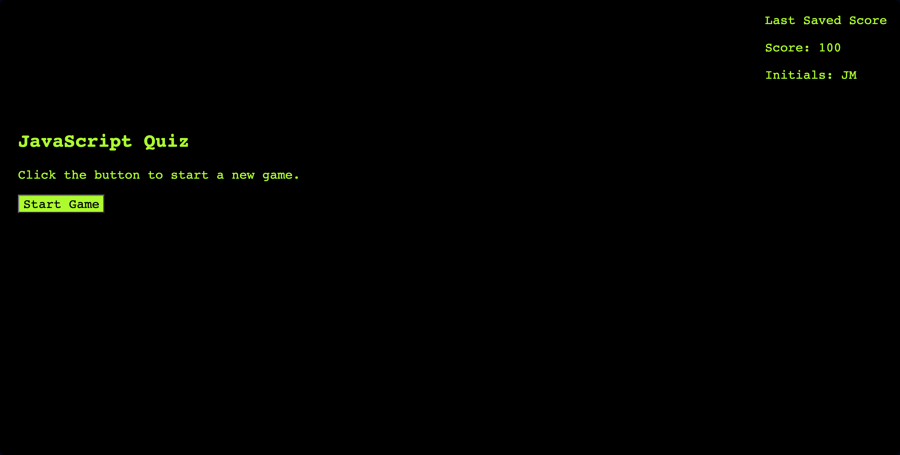
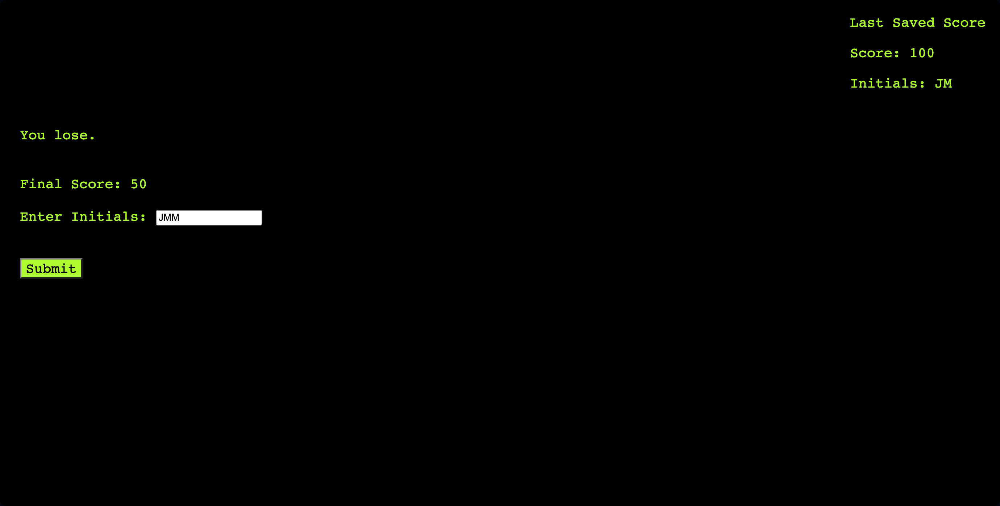

# JavaScript Quiz Game

## Description

This is a multiple choice quiz game built with JavaScript, HTML, and CSS. The game presents the user with a series of multiple choice questions about JavaScript, keeps track of the score and time remaining, and saves the final score along with initials in local storage.

When the game starts, the user is presented with a question and four possible choices. After selecting an answer, the user is notified if they were correct or incorrect. If correct, 10 points are added to the score. If incorrect, 10 seconds are subtracted from the time remaining.

The game ends when all questions have been answered or the timer reaches 0. At the end, the final score and initials are saved to localStorage. The last saved score and initials are displayed on the screen.

## Usage

To use the quiz application:

1. Click the "Start Game" button to begin the quiz.
2. Select an answer for each multiple choice question before time runs out.
3. At the end of the game, enter initials and click "Submit" to save final score.
4. The last score and initials will be displayed on the main screen.
5. Click "Start Game" to begin a new game session.

The app is fully playable and saves high scores locally.

## Screenshots

The following image demonstrates the web application's appearance and functionality:

## Deployment Link

https://jmlouf.github.io/javascript-quiz-game/

## Credits

This project was created for educational purposes as part of the KU Coding Bootcamp curriculum.

The following resources were utilized:

- KU Coding Bootcamp Spot - Provided project requirements and guidelines.
- KU GitLab Project - Provided examples of code used within this project.
- W3Schools - Referenced for general HTML, CSS and JavaScript questions.
- freeCodeCamp.org - Referenced for general JavaScript concepts and best practices.
- InterviewBit.com - Referenced for interview questions used for JavaScript question bank.
- BBBootstrap.com - Reference for code snippets and templates used for JavaScript question bank.
- dev.to - Referenced for CSS styling.
- stackoverflow.com - Referenced for dynamic generation of quiz questions within this project.
- MDN Web Docs - Referenced for working with objects.

## License

Please refer to the LICENSE in the repository.